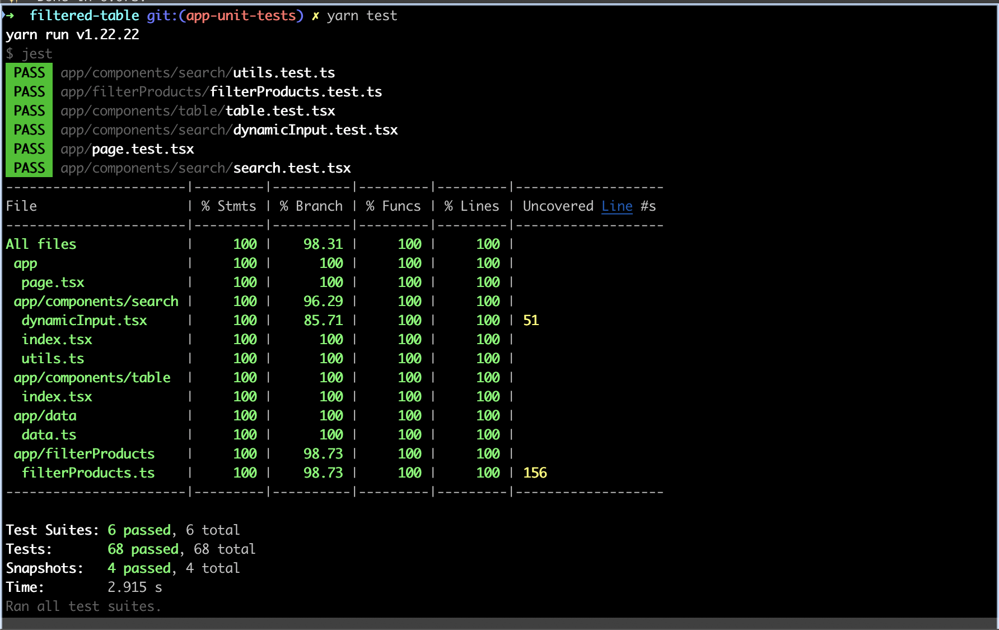

# Salsify Code Challenge by Filipa Lacerda

**Table of Contents**

- [Salsify Code Challenge by Filipa Lacerda](#salsify-code-challenge-by-filipa-lacerda)
- [Decisions](#decisions)
  - [Technical Stack Decision](#technical-stack-decision)
    - [Styling Decision](#styling-decision)
    - [Filters decisions](#filters-decisions)
      - [`contains`, `less_than`, `greater_than`, `equals`](#contains-less_than-greater_than-equals)
      - [`none` filter](#none-filter)
      - [`value` field of the search](#value-field-of-the-search)
      - [Filtered results](#filtered-results)
      - [Unit tests decisions](#unit-tests-decisions)
  - [Code Structure](#code-structure)
    - [Components](#components)
  - [Development Process](#development-process)
  - [Future improvements](#future-improvements)
  - [Run the Project](#run-the-project)
    - [Run locally](#run-locally)
    - [Run tests](#run-tests)
      - [Output:](#output)

# Decisions

Below you can find the reason behind all the decisions I've made.
I've taken into consideration the spec of the exercise, but there were
some decisions I had to make. Either because I wasn't 100% sure of the specs (like the [`none` filter](#none-filter)) or because I wanted
to improve the user's experience (like the [`input` type decision](#value-field-of-the-search))

## Technical Stack Decision

I know Salsify uses Ember, however it's been over 10 years since I've used Ember.
And during a week I wouldn't have time to re-learn ember and submit a good code solution for this exercise.

Joana mentioned in the interview process that I should choose the tool I'm most comfortable with. Although I could have done it with vanilla Javascript, I used React.

This project uses a React and Nextjs application using TypeScript.
For unit tests, it uses Jest and React Testing Library.

### Styling Decision

Since no design was provided, I implemented a very basic CSS.
The app should be as responsible as possible with an overflow table.
It's tested in Chrome, Firefox, and Safari.

### Filters decisions

#### `contains`, `less_than`, `greater_than`, `equals`

1. To allow the user to still see the values when selecting one of these operators the filter is only applied if a value was typed in.
2. After the value is typed in, the filter is applied
3. I followed this approach to allow the user to see the results still when applying a search with the three possible fields

#### `none` filter

1. I'm not sure if I fully understood the `none` filter.
2. From my understanding, we want to return the products where the property selected does not have a value
3. However, in this dataset, if the property selected does not have a value, the object in `property_values` array of the product does not exist at all.
4. This means I can't filter the product by the selected property and check if the `value` property is not defined.
5. To implement this filter, I assumed that the property selected has to be taken into consideration and that the property ID matches the index in the `property_values` array.
6. I'm a little concerned that this solution does not meet the expectations since it's stated that the `Properties and Products vary from customer to customer, you cannot depend on having the same properties or products available each time this application loads`

#### `value` field of the search

1. I assumed the `[property value]` field to be rendered must match the property type.
2. In the beginning, as you can see from the commit history, I created an input with type `number` for this case
3. However, for the `in` filter, this meant the user wouldn't be able to type more than one number
4. So I decided to implement a `text` input instead.

#### Filtered results

1. For some `operators` types, I check that a `value` is provided before performing the search action.
2. The reason behind this, is to allow the user to still see all the products before starting to type a value.

#### Unit tests decisions

1. Unit tests were added both for each component, the utility functions, and the main App page.
2. While the component's tests test the component behaviour, the App page tests test the behavior of all the components working together and user interaction.
3. The tests for `filterProducts` are a bit overzealous. I wanted to test each filter function individually but I also wanted to test the if statements and the switch case on the main function.
4. The components have full coverage of all the user interactions and conditional rendering, I always like to make sure all the logic is covered. Although I can adapt to the methodology of Salsify.

## Code Structure

The code is divided into several parts:

- `dataset`: The data object that was provided
- `components`: The components used to render the application. Ideally, they would be reusable components without any logic associated, but due to the specificity of the application, I decided to keep some logic within the components.
- `types`: A file with all the common types
- `unit tests`: Unit tests can be found in the components folder, or the root folder for the main page of the application.
- `filterProducts`: Where the filters are being performed, according to the `property`, the `operator`, and the `value`

### Components

1. `search` component:
   1. This component is not meant to be reusable, since it's tied with the data formats of the properties and operators.
   2. Initially, I implemented a solution where the filters would only be applied if the search button was clicked. But I then understood that this was not the requirement.
   3. The component filters the operators available based on the property selected.
   4. The component renders a different type of input based on the property selected, allowing for a text input or a select to be displayed
2. `dynamicInput` component:
   1. I decided to extract this logic into a separate component to reduce code complexity in the `search` component and to allow for easier unit tests
   2. The logic behind the property type can be found in the `utils` file, in the `filterOperators` function
3. `table` component:
   1. This component renders the provided headers
   2. If there are products to be displayed, the component will render them
   3. Otherwise, the component renders a row displaying the informational text saying that there are no results to show.

## Development Process

This can be seen through the commit history in the repository too.
I've opened feature PRs for each step of the development process like I would do if I was working together with a team.

1. I started by creating a Nextjs+React+TypeScript application
2. The next step was to add the `datastore` to the application.
3. Next I fetched the data and stored it in the main App using the React hooks
4. The next step was to create the table component to list the Products. This is a simple component that takes the headers and a list of rows and each row as an array of cells.
5. The next step was to build the Search component. This is not a reusable component since it's tied with the logic from the properties and the operators, and that might change from customer to customer. I tried to extract the utility functions into a different file, to allow for easier unit tests and improved readability.
6. After having the two main components, I moved into the filtering logic. Here I created a function for each type of operator.
7. After that I created a very basic CSS for the application. The CSS for each component is located near the component and the CSS for the main application is in the `globals.css` file. This file is generated by default by Next.js
8. The unit test cases were written before I started writing the code to make sure it followed all the requirements. Some unit tests were added after as I realized that the initial tests would not cover all the scenarios.
9. The last step was to update the README and do some UI enhancements, like capitalizing the Property names on the table.

## Future improvements

1. The `none` filter should be improved. I don't think this solution would work for different Properties and Products from customer to customer if the data does not follow the assumption that the property ID matches the index of the object in the property_values array of each product.
2. In a real-world application, we would most likely be fetching an API, which means I'd be implementing a loading and an error state

## Run the Project

You can see the result here: [https://filipalacerda.github.io/filtered-table/](https://filipalacerda.github.io/filtered-table/)

If you want to run the project locally, follow the instructions below:

### Run locally

```bash
yarn dev
```

Open [http://localhost:3000](http://localhost:3000) with your browser to see the result.

### Run tests

```bash
yarn test
```

#### Output:


